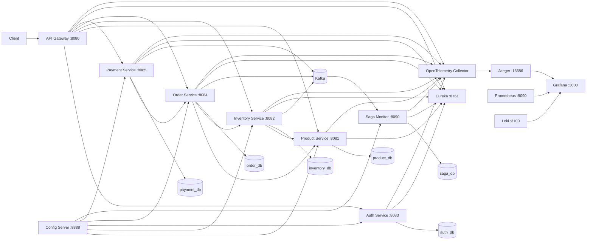

# Spring E-Commerce Microservices

Production-oriented e-commerce backend built with **Java 21, Spring Boot 4.1.1, Spring Cloud, PostgreSQL, Kafka, Docker Compose, Eureka, Config Server, Resilience4j, OpenTelemetry, Prometheus, Grafana, Jaeger, Loki, and Grafana Alloy**.

The project demonstrates a complete microservice flow covering product management, inventory reservations, authentication, order processing, payment processing, synchronous service-to-service communication, resilience patterns, transactional outbox messaging, Kafka event propagation, saga monitoring, centralized configuration, service discovery, observability, and end-to-end testing.

> **Status:** Final end-to-end flow verified successfully with Docker Compose.  
> Expected final test result: `FINAL E2E PASSED` and Saga status `COMPLETED`.

---

## Table of Contents

- [Architecture](#architecture)
- [Services](#services)
- [Main Business Flow](#main-business-flow)
- [Technology Stack](#technology-stack)
- [Prerequisites](#prerequisites)
- [Quick Start with Docker Compose](#quick-start-with-docker-compose)
- [Environment Variables](#environment-variables)
- [Verify the System](#verify-the-system)
- [Run the Final E2E Test](#run-the-final-e2e-test)
- [Observability](#observability)
- [Service Discovery and Centralized Configuration](#service-discovery-and-centralized-configuration)
- [Kafka and Transactional Outbox](#kafka-and-transactional-outbox)
- [Saga Monitoring and Compensation](#saga-monitoring-and-compensation)
- [Resilience](#resilience)
- [Security](#security)
- [Local Development Without Full Docker](#local-development-without-full-docker)
- [Database Notes](#database-notes)
- [Useful Docker Commands](#useful-docker-commands)
- [Troubleshooting](#troubleshooting)
- [Project Structure](#project-structure)
- [Final Validation Checklist](#final-validation-checklist)

---

# Architecture



The project uses both synchronous and asynchronous communication:

- **Synchronous communication** handles immediate business operations such as product validation, inventory reservation, order confirmation, and payment/order integration.
- **Kafka + Transactional Outbox** publishes domain events reliably after database transactions.
- **Saga Monitor** builds a cross-service view of the transaction and detects completed or compensation-required flows.

---

# Services

| Service | Port | Responsibility |
|---|---:|---|
| API Gateway | `8080` | Main entry point, JWT validation, RBAC, routing, resilience, security headers |
| Product Service | `8081` | Products, categories, search/filtering, pagination, SKU rules |
| Inventory Service | `8082` | Stock, reservations, release, confirmation, compensation |
| Auth Service | `8083` | Registration, login, JWT access token, refresh token |
| Order Service | `8084` | Order lifecycle and Product/Inventory integration |
| Payment Service | `8085` | Payment lifecycle and Order integration |
| Saga Monitor Service | `8090` | Kafka event projection, saga state, stale saga detection, compensation |
| Eureka Discovery Server | `8761` | Service registration and discovery |
| Spring Cloud Config Server | `8888` | Centralized configuration |

Infrastructure:

| Component | Port | Purpose |
|---|---:|---|
| Kafka | host `9092` | Domain event transport |
| Prometheus | `9090` | Metrics collection |
| Grafana | `3000` | Metrics/logs/traces visualization |
| Jaeger | `16686` | Distributed tracing UI |
| Loki | `3100` | Log storage |
| OpenTelemetry Collector | internal `4317/4318` | Telemetry collection |
| Grafana Alloy | internal | Docker log collection |

---

# Main Business Flow

The verified happy-path flow is:

```text
Create Product
    ↓
Create Inventory
    ↓
Create Order
    ↓
Order validates Product
    ↓
Order reserves Inventory
    ↓
Order = PENDING
    ↓
Create Payment
    ↓
Payment validates Order
    ↓
Payment = PROCESSING
    ↓
Payment succeeds
    ↓
Payment calls Order confirmation
    ↓
Order confirms Inventory reservation
    ↓
Inventory stock is consumed
    ↓
Order = CONFIRMED
    ↓
Payment = SUCCEEDED
    ↓
Transactional Outbox publishes events
    ↓
Kafka
    ↓
Saga Monitor
    ↓
Saga = COMPLETED
```

The final automated E2E test validates this complete chain.

---

# Technology Stack

## Backend

- Java 21
- Spring Boot 4.1.1
- Spring Web MVC
- Spring Data JPA
- Hibernate
- Jakarta Validation
- Lombok
- Flyway
- Spring Boot Actuator
- OpenAPI

## Data

- PostgreSQL 18
- Separate database per service

## Microservice Infrastructure

- Spring Cloud Config
- Netflix Eureka
- Spring Cloud LoadBalancer
- Resilience4j
- Apache Kafka
- Transactional Outbox Pattern
- Choreography-style Saga monitoring

## Observability

- Micrometer
- Prometheus
- OpenTelemetry
- Jaeger
- Loki
- Grafana Alloy
- Grafana

## Testing

- JUnit 5
- Mockito
- Testcontainers
- PowerShell E2E test

## Runtime / Deployment

- Docker
- Docker Compose
- Multi-stage Maven/Java Docker builds

---

# Prerequisites

For the recommended Docker-based setup, install:

- **Docker Desktop**
- **Docker Compose v2**
- **Git**
- PowerShell if you want to run the provided Windows E2E script

You do **not** need to install PostgreSQL, Kafka, Prometheus, Grafana, Jaeger, or the individual Spring Boot services separately when running the complete Docker Compose stack.

For development directly from IntelliJ:

- JDK 21 or newer
- IntelliJ IDEA
- Maven support
- Local PostgreSQL if a service is run outside Docker

Check Docker:

```powershell
docker --version
docker compose version
```

---

# Quick Start with Docker Compose

## 1. Clone the repository

```powershell
git clone <YOUR_REPOSITORY_URL>
cd spring-ecommerce-microservices
```

## 2. Create the root `.env`

Create a file named:

```text
.env
```

in the repository root, next to `docker-compose.yml`.

Example:

```env
JWT_SECRET=REPLACE_WITH_BASE64_32_BYTE_SECRET
POSTGRES_PASSWORD=change-me
GRAFANA_ADMIN_USER=admin
GRAFANA_ADMIN_PASSWORD=admin
TRACING_SAMPLING_PROBABILITY=1.0
OUTBOX_PUBLISH_INTERVAL_MS=1000
SAGA_TIMEOUT_MS=60000
```

Do not commit your real `.env`.

## 3. Generate a JWT secret

The Auth Service and API Gateway must use the **same** JWT secret.

A Base64-encoded 32-byte value is recommended.

PowerShell example:

```powershell
$bytes = New-Object byte[] 32
[System.Security.Cryptography.RandomNumberGenerator]::Fill($bytes)
[Convert]::ToBase64String($bytes)
```

Copy the generated value into:

```env
JWT_SECRET=<generated-value>
```

## 4. Start the complete system

```powershell
docker compose up -d --build
```

The first build can take several minutes because Maven dependencies and Docker images may need to be downloaded.

## 5. Check container status

```powershell
docker compose ps
```

The important services should be `Up`, and database/Kafka/config/discovery containers with health checks should become `healthy`.

Expected core state:

```text
product-db              healthy
inventory-db            healthy
auth-db                 healthy
order-db                healthy
payment-db              healthy
saga-db                 healthy
kafka                    healthy
discovery-server         healthy
config-server            healthy

product-service          Up
inventory-service        Up
auth-service             Up
order-service            Up
payment-service          Up
saga-monitor-service     Up
api-gateway              Up
```

---

# Environment Variables

Root `.env` values used by Docker Compose:

| Variable | Purpose | Example |
|---|---|---|
| `JWT_SECRET` | Shared JWT signing secret for Auth and Gateway | Base64 32-byte secret |
| `POSTGRES_PASSWORD` | Password assigned to Docker PostgreSQL containers | `change-me` |
| `GRAFANA_ADMIN_USER` | Grafana login user | `admin` |
| `GRAFANA_ADMIN_PASSWORD` | Grafana login password | `admin` |
| `TRACING_SAMPLING_PROBABILITY` | Trace sampling rate | `1.0` |
| `OUTBOX_PUBLISH_INTERVAL_MS` | Outbox polling interval | `1000` |
| `SAGA_TIMEOUT_MS` | Time before an incomplete saga can require compensation | `60000` |

For a production environment:

- Use secret management instead of a plain `.env`.
- Use strong database passwords.
- Reduce tracing sampling if full tracing is too expensive.
- Do not use default Grafana credentials.
- Do not commit secrets.

---

# Verify the System

After startup, open:

### Eureka

```text
http://localhost:8761
```

You should see registered services after they finish starting.

### Config Server

Example:

```text
http://localhost:8888/order-service/default
```

A JSON configuration response indicates that Config Server is serving centralized configuration correctly.

### Gateway

```text
http://localhost:8080
```

The Gateway is the intended public entry point for application APIs.

### Individual services

Development ports are also mapped to localhost:

```text
Product     http://localhost:8081
Inventory   http://localhost:8082
Auth        http://localhost:8083
Order       http://localhost:8084
Payment     http://localhost:8085
Saga        http://localhost:8090
```

The business services are bound to `127.0.0.1` in the Docker Compose development setup.

---

# Run the Final E2E Test

A complete E2E script is included:

```text
scripts/e2e-final.ps1
```

Run it from the repository root:

```powershell
.\scripts\e2e-final.ps1
```

The script waits for the required services, then performs a real business transaction across the microservices.

Expected output:

```text
Waiting for business services and saga monitor...
Creating category...
Creating product...
Creating inventory...
Creating order...
Creating payment...
Processing payment...
Succeeding payment...
Waiting for transactional outbox -> Kafka -> Saga projection...

FINAL E2E PASSED
Product ID: ...
Order ID: ...
Payment ID: ...
Saga: COMPLETED
```

A successful run confirms:

- Product Service works
- Inventory Service works
- Order Service works
- Payment Service works
- service-to-service integrations work
- inventory reservation/confirmation works
- payment success flow works
- Transactional Outbox works
- Kafka publishing/consumption works
- Saga Monitor receives the events
- Saga reaches `COMPLETED`

---

# Observability

## Prometheus

```text
http://localhost:9090
```

Use the **Targets** page to verify that configured Spring services are being scraped.

## Grafana

```text
http://localhost:3000
```

Credentials come from:

```env
GRAFANA_ADMIN_USER
GRAFANA_ADMIN_PASSWORD
```

Grafana is provisioned to work with the project's observability stack.

## Jaeger

```text
http://localhost:16686
```

Use it to inspect distributed traces produced through OpenTelemetry.

## Loki

```text
http://localhost:3100
```

Loki stores application/container logs.

## Grafana Alloy

Alloy reads Docker container logs and forwards them to Loki.

## OpenTelemetry Collector

The collector receives telemetry from the Spring Boot services and exports tracing data to Jaeger.

Inside the Docker network, services use:

```text
http://otel-collector:4318
```

---

# Service Discovery and Centralized Configuration

## Eureka

`discovery-server` runs on port `8761`.

Services register with:

```text
http://discovery-server:8761/eureka/
```

inside Docker.

The API Gateway uses service discovery and load-balanced service URIs such as:

```text
lb://product-service
lb://inventory-service
lb://auth-service
lb://order-service
lb://payment-service
```

## Config Server

`config-server` runs on port `8888`.

Central configuration files are stored under:

```text
config-repo/
```

Inside Docker, Config Server reads them from:

```text
file:/config-repo
```

The application keeps configuration externalized so common infrastructure values can be controlled centrally.

---

# Kafka and Transactional Outbox

Inventory, Order, and Payment services use a **Transactional Outbox Pattern**.

Instead of directly publishing to Kafka inside a business transaction:

1. The service changes business state.
2. An outbox event is written in the same database transaction.
3. A scheduled publisher finds pending outbox events.
4. The event is published to Kafka.
5. The event is marked as published after Kafka acknowledgement.

This reduces the risk of database state being committed while its corresponding Kafka event is lost.

Kafka topics:

```text
order.events
inventory.events
payment.events
```

Example event types include:

### Order

```text
ORDER_CREATED
ORDER_CONFIRMED
ORDER_COMPLETED
ORDER_CANCELLED
```

### Inventory

```text
INVENTORY_RESERVED
INVENTORY_RELEASED
INVENTORY_CONFIRMED
INVENTORY_COMPENSATED
```

### Payment

```text
PAYMENT_CREATED
PAYMENT_PROCESSING
PAYMENT_SUCCEEDED
PAYMENT_FAILED
PAYMENT_CANCELLED
PAYMENT_REFUNDED
```

## Kafka addresses

Inside Docker:

```text
kafka:9092
```

From the host machine:

```text
localhost:9092
```

The Docker Compose configuration provides separate internal/external listeners so both scenarios can work.

---

# Saga Monitoring and Compensation

`saga-monitor-service` listens to:

```text
order.events
inventory.events
payment.events
```

and creates a saga projection for each order.

A normal successful flow eventually reaches:

```text
COMPLETED
```

The monitor can detect incomplete/stale flows and mark them:

```text
COMPENSATION_REQUIRED
```

The configured default timeout is:

```env
SAGA_TIMEOUT_MS=60000
```

The compensation flow can:

- fail a processing payment where applicable
- compensate inventory
- restore stock when a confirmed reservation needs to be reversed
- cancel a pending order
- mark the saga as compensated

Inventory reservation status also supports:

```text
COMPENSATED
```

---

# Resilience

The project applies resilience differently depending on whether an operation is safe to repeat.

## Read operations

GET operations may use:

- timeout
- retry
- circuit breaker

Current general policy:

```text
Sliding window:          10
Minimum calls:           5
Failure threshold:       50%
Open wait:               10 seconds
Half-open calls:         2
GET attempts:            2 total
Retry delay:             250 ms
```

## Mutating operations

Operations such as:

```text
POST
PATCH
```

do **not** use blind automatic retries.

This avoids duplicate side effects when a downstream service commits a request but its response is lost.

Examples:

- Order → Inventory mutation: timeout + circuit breaker, no blind retry
- Payment → Order mutation: timeout + circuit breaker, no blind retry

The API Gateway also provides service-unavailable fallbacks.

---

# Security

Authentication is based on JWT.

The Auth Service provides:

- registration
- login
- access tokens
- refresh tokens

The API Gateway provides:

- JWT validation
- role-based authorization
- protected routes
- security headers

The same `JWT_SECRET` must be supplied to both:

```text
auth-service
api-gateway
```

## Important deployment note

This repository is a production-oriented architecture/demo, but a real internet-facing production deployment should also add:

- independent authentication/authorization between internal services
- a proper secret manager
- TLS
- restricted infrastructure network access
- database credential rotation
- Kafka authentication/authorization where required
- secured administrative/compensation endpoints
- environment-specific observability and retention policies

In the current Docker development setup, business service ports are exposed only on `127.0.0.1`, while the API Gateway is the intended application entry point.

---

# Local Development Without Full Docker

Running the entire platform through Docker Compose is the easiest and most reproducible setup.

However, individual Spring applications can also be started from IntelliJ.

A common hybrid development setup is:

```text
IntelliJ:
- discovery-server
- config-server
- one Spring service being developed

Docker:
- Kafka and/or supporting infrastructure
```

Do not run the same application both in IntelliJ and Docker at the same time, otherwise the same host port may already be in use.

## Example: Saga Monitor from IntelliJ

Create/run a local PostgreSQL database:

```sql
CREATE DATABASE saga_db;
```

Set IntelliJ Run Configuration environment variables:

```env
DB_URL=jdbc:postgresql://localhost:5432/saga_db
DB_USERNAME=postgres
DB_PASSWORD=<your-local-postgres-password>

EUREKA_URL=http://localhost:8761/eureka/
KAFKA_BOOTSTRAP_SERVERS=localhost:9092
```

If the OpenTelemetry Collector is not running locally, telemetry exporters can be disabled for that IntelliJ run:

```text
--management.otlp.metrics.export.enabled=false
--management.tracing.export.otlp.enabled=false
```

These can be added under:

```text
Run
→ Edit Configurations
→ SagaMonitorApplication
→ Program arguments
```

When Kafka is running through Docker, verify host connectivity:

```powershell
Test-NetConnection localhost -Port 9092
```

Expected:

```text
TcpTestSucceeded : True
```

---

# Database Notes

Each business service owns a separate PostgreSQL database:

```text
product_db
inventory_db
auth_db
order_db
payment_db
saga_db
```

Docker volumes persist database data between normal container restarts.

Because the project uses PostgreSQL 18, Docker database volumes are mounted at:

```text
/var/lib/postgresql
```

## Reset all Docker database data

Only do this if you intentionally want to delete the Docker-managed database data:

```powershell
docker compose down -v
docker compose up -d --build
```

`-v` deletes Docker volumes associated with this Compose project.

It does **not** delete a separately installed local PostgreSQL instance, but it does remove the Docker databases for this project.

---

# Useful Docker Commands

Start everything:

```powershell
docker compose up -d --build
```

Show running containers:

```powershell
docker compose ps
```

Show all containers including exited ones:

```powershell
docker compose ps -a
```

Follow logs:

```powershell
docker compose logs -f
```

Follow one service:

```powershell
docker compose logs -f order-service
```

Show the last 100 lines:

```powershell
docker compose logs order-service --tail=100
```

Restart one service:

```powershell
docker compose restart order-service
```

Stop the stack without deleting volumes:

```powershell
docker compose down
```

Stop and delete volumes:

```powershell
docker compose down -v
```

Rebuild one service:

```powershell
docker compose up -d --build order-service
```

---

# Troubleshooting

## A service stays in `Created`

Check dependencies first:

```powershell
docker compose ps -a
```

If its database is `Exited`, inspect the database logs:

```powershell
docker compose logs product-db --tail=100
```

A dependent Spring service may remain `Created` until a required `service_healthy` dependency becomes healthy.

---

## Kafka works in Docker but IntelliJ cannot connect

Verify:

```powershell
Test-NetConnection localhost -Port 9092
```

Expected:

```text
TcpTestSucceeded : True
```

For a host-running application:

```env
KAFKA_BOOTSTRAP_SERVERS=localhost:9092
```

For a Docker-running application:

```env
KAFKA_BOOTSTRAP_SERVERS=kafka:9092
```

---

## `UnknownHostException: kafka`

A host/IntelliJ application cannot resolve Docker Compose service names such as:

```text
kafka
discovery-server
config-server
```

Use localhost equivalents when running outside Docker:

```text
localhost:9092
localhost:8761
localhost:8888
```

---

## Config Server connection refused

Verify:

```text
http://localhost:8888/order-service/default
```

For IntelliJ/local runs:

```env
CONFIG_SERVER_URL=http://localhost:8888
```

For Docker:

```env
CONFIG_SERVER_URL=http://config-server:8888
```

---

## Eureka connection refused

For IntelliJ/local runs:

```env
EUREKA_URL=http://localhost:8761/eureka/
```

For Docker:

```env
EUREKA_URL=http://discovery-server:8761/eureka/
```

---

## OTLP `localhost:4318` connection errors in IntelliJ

If the OpenTelemetry Collector is not running, disable exporters for that local run:

```text
--management.otlp.metrics.export.enabled=false
--management.tracing.export.otlp.enabled=false
```

Do not disable them in the complete Docker stack, because the collector is included there.

---

## PostgreSQL password changed but old Docker volume still exists

Changing:

```env
POSTGRES_PASSWORD=...
```

does not automatically change the password inside an already initialized PostgreSQL volume.

If the Docker database data can safely be deleted:

```powershell
docker compose down -v
docker compose up -d --build
```

Otherwise change the existing database user's password manually instead of deleting the volume.

---

## Port already in use

Check whether the same service is still running in IntelliJ.

Typical ports:

```text
8080 Gateway
8081 Product
8082 Inventory
8083 Auth
8084 Order
8085 Payment
8090 Saga
8761 Eureka
8888 Config
9090 Prometheus
9092 Kafka
3000 Grafana
16686 Jaeger
3100 Loki
```

Do not run the same service in Docker and IntelliJ simultaneously unless you deliberately change one of the ports.

---

# Project Structure

```text
spring-ecommerce-microservices/
│
├── api-gateway/
├── auth-service/
├── product-service/
├── inventory-service/
├── order-service/
├── payment-service/
│
├── saga-monitor-service/
├── discovery-server/
├── config-server/
├── config-repo/
│
├── infra/
│   ├── prometheus/
│   ├── otel/
│   ├── loki/
│   ├── alloy/
│   └── grafana/
│
├── scripts/
│   └── e2e-final.ps1
│
├── docker-compose.yml
├── .env
├── .env.final.example
├── FINAL_ARCHITECTURE.md
├── FINAL_RUNBOOK.md
└── README.md
```

---

# Final Validation Checklist

Before considering a local installation healthy:

```text
[ ] docker compose ps shows all expected services as Up
[ ] all six PostgreSQL databases are healthy
[ ] Kafka is healthy
[ ] Eureka is healthy
[ ] Config Server is healthy
[ ] Product Service is running
[ ] Inventory Service is running
[ ] Auth Service is running
[ ] Order Service is running
[ ] Payment Service is running
[ ] Saga Monitor is running
[ ] API Gateway is running
[ ] Prometheus opens
[ ] Grafana opens
[ ] Jaeger opens
[ ] Eureka dashboard opens
[ ] .\scripts\e2e-final.ps1 returns FINAL E2E PASSED
[ ] final Saga status is COMPLETED
```

Verified final E2E shape:

```text
Product → Inventory → Order → Payment
                     ↓
              Transactional Outbox
                     ↓
                   Kafka
                     ↓
                Saga Monitor
                     ↓
                 COMPLETED
```

---

## Final Result

The project combines:

- independently owned service databases
- synchronous microservice integrations
- API Gateway authentication and routing
- service discovery
- centralized configuration
- resilience patterns
- transactional outbox
- Kafka event-driven communication
- saga monitoring and compensation
- distributed tracing
- metrics
- centralized logging
- Docker-based reproducible local infrastructure
- automated end-to-end verification

It is intended as a strong reference project for learning and demonstrating modern Spring Boot microservice architecture while keeping the complete system runnable on a local development machine.
